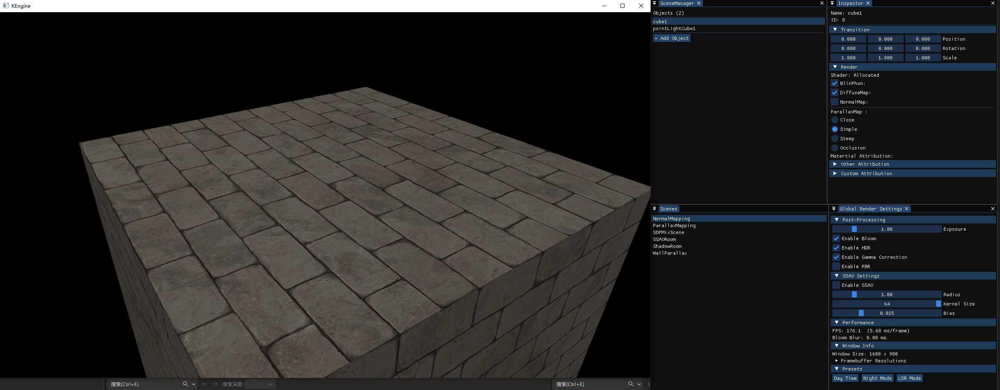

# KEngine 

这是一个面向求职展示的渲染子系统工程样例（基于 Hazel 教程与 LearnOpenGL 的延伸实现）。


核心亮点
- 延迟渲染管线（G-buffer）
- 屏幕空间效果：SSAO（开/关）
- 法线贴图、视差贴图（开/关）
- 阴影过滤对比：硬阴影 / PCF / PCSS（三选一实时切换）
- 点光与平行光阴影（包含立方体 shadow map）
- ImGui 实时控制面板（参数与开关）

快速目录
```

```


- `screenshots/engine_overview.png`        — 引擎运行整体界面（全窗口）
- `screenshots/normal_off.png`            — 关闭法线贴图的画面
- `screenshots/normal_on.png`             — 打开法线贴图的画面
- `screenshots/sdfmix.png`                — SDFMix 场景效果截图
- `screenshots/ssao_off.png`              — 关闭 SSAO 的画面
- `screenshots/ssao_on.png`               — 打开 SSAO 的画面
- `screenshots/parallax_off.png`          — 关闭视差贴图的画面
- `screenshots/parallax_simple.png`           — 打开视差贴图的画面
- `screenshots/parallax_steep.png`           — 打开视差贴图的画面
- `screenshots/parallax_occlusion.png`           — 打开视差贴图的画面
- `screenshots/shadow_hard.png`           — 硬阴影（Hard）效果
- `screenshots/shadow_pcf.png`            — PCF（软阴影）效果
- `screenshots/shadow_pcss.png`           — PCSS（物理软阴影）效果


构建与运行
1. 安装 Visual Studio 2022（含 C++ 桌面开发）。
2. 克隆仓库并确保 submodules（若有）已初始化：
   - git clone --recurse-submodules <repo>
3. 用项目生成脚本或直接打开生成的 solution 并编译（详见项目根目录文档）。
4. 运行 `Sandbox` 可执行程序，打开 `ShadowRoom` / `SSAORoom` / `SDFMix` 等场景进行演示。

演示控制（ImGui）
- Global Render Settings 面板：
  - Exposure / HDR / Bloom / Gamma
  - SSAO 开/关 与参数
  - 法线贴图、视差贴图开关
  - 阴影过滤模式（Hard / PCF / PCSS）


技术要点
- 着色器组织：以字符串内联方式构建 shader，运行时通过 Shader 类编译并绑定 UBO。
- 阴影：实现了平行光 shadow map（深度 FBO）与点光立方体 shadow map，两者在 Lighting Pass 中读取用于阴影测试。
- 阴影过滤：PCF 使用 3x3 采样；PCSS 为近似实现（blocker search + radius 估算 + 可变半径 PCF）。
- 后处理：HDR、Bloom 与可选高斯模糊的 ping-pong 渲染。




## 联系方式


---

