# KEngine

**渲染子系统工程样例**（基于 *Hazel* 教程与 *LearnOpenGL* 的延伸实现）。  
重点覆盖：**延迟渲染（G-buffer）**、**SSAO**、**法线/视差贴图**、**多种阴影过滤（Hard/PCF/PCSS）**、以及 **ImGui 实时调参面板**。

---

## 核心亮点

- **延迟渲染管线（Deferred Rendering / G-buffer）**
- **屏幕空间效果**：SSAO（可开关）
- **材质细节**：法线贴图（可开关）、视差贴图（可开关，包含多种模式）
- **阴影过滤对比**：Hard / PCF / PCSS（三选一实时切换）
- **光源与阴影**：
  - 平行光阴影（2D shadow map）
  - 点光阴影（Cubemap shadow map）
- **ImGui 实时控制面板**：参数与开关即时生效，便于演示与对比

---

### 引擎整体


### SSAO（Off / On）

| SSAO Off | SSAO On |
|---|---|
| 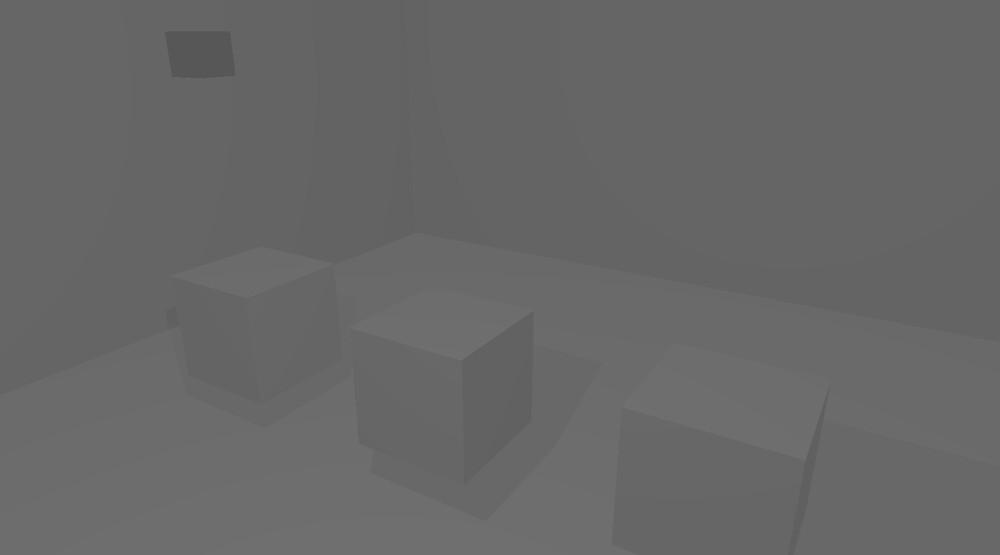 | 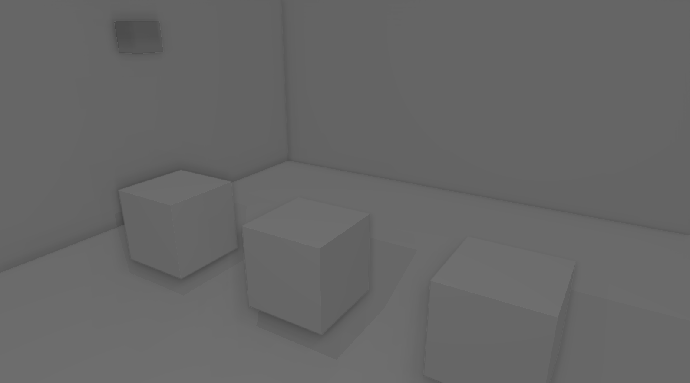 |

### 法线贴图（Off / On）

| Normal Off | Normal On |
|---|---|
| 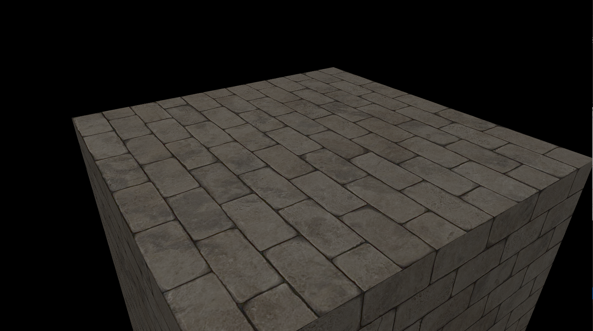 |  |

### 视差贴图（多模式对比）

| Parallax Off | Simple |
|---|---|
| 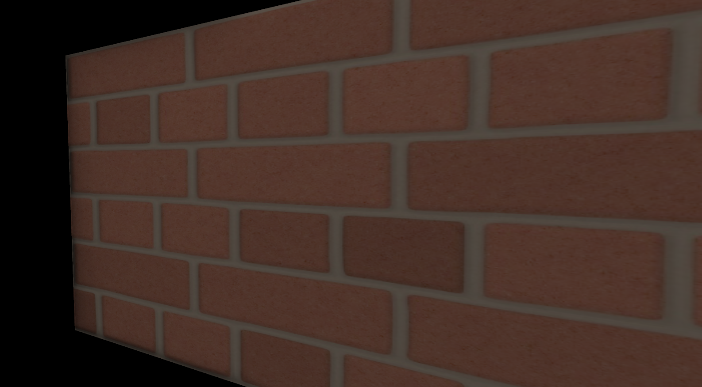 | 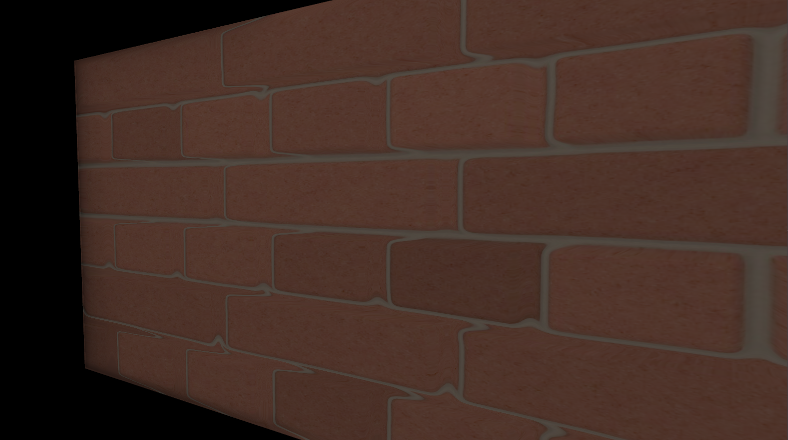 |

| Steep | Occlusion |
|---|---|
| 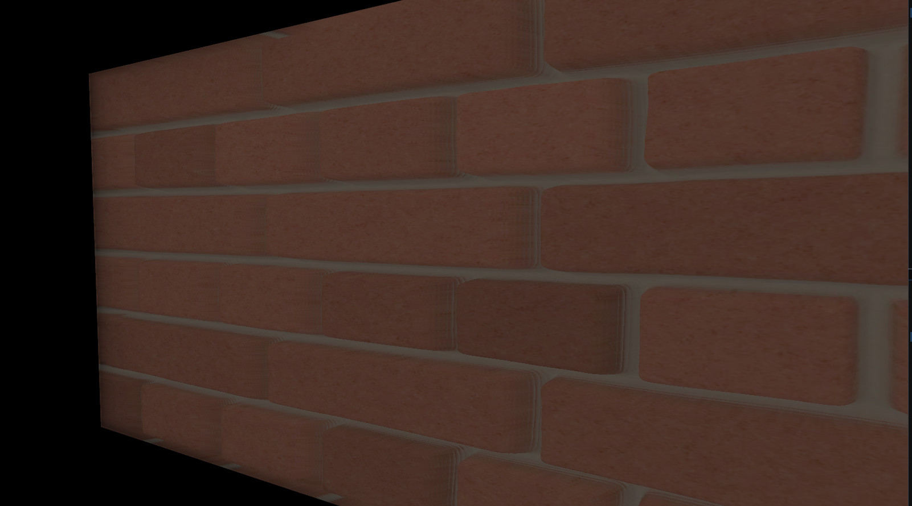 | 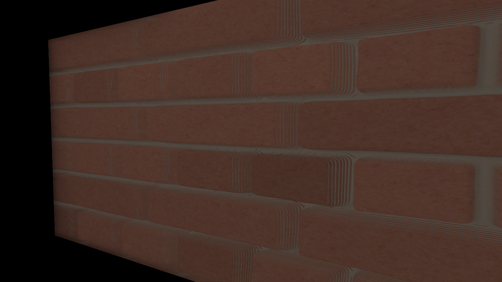 |

### 阴影过滤（Hard / PCF / PCSS）

| Hard | PCF | PCSS |
|---|---|---|
| 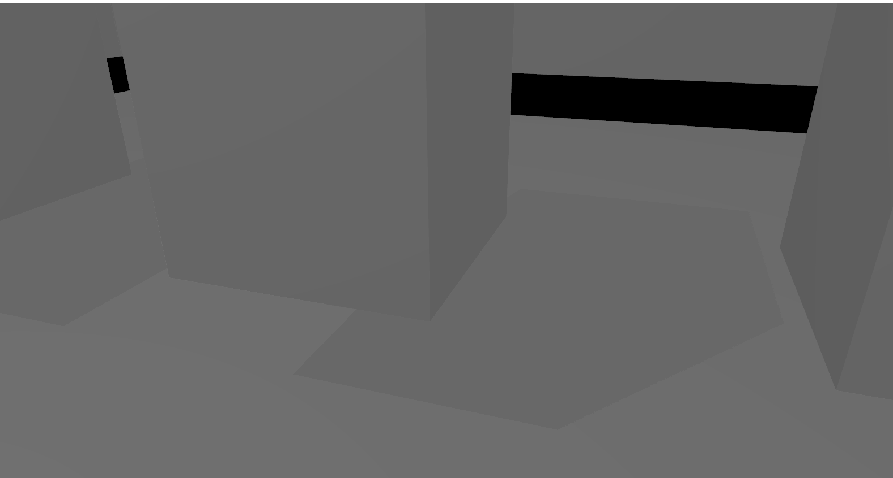 | 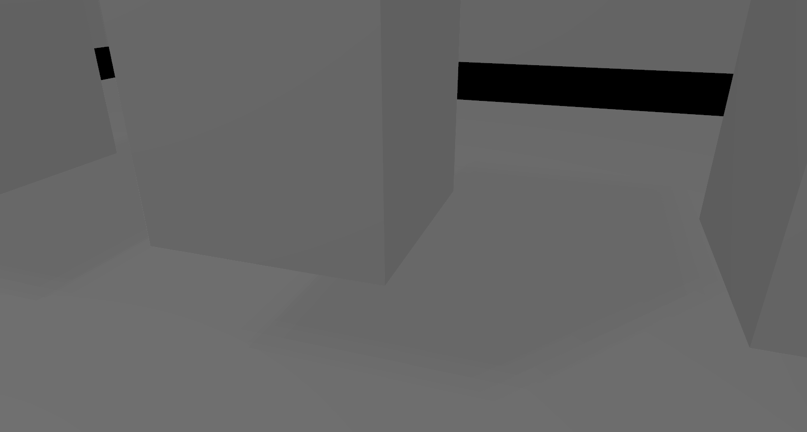 | 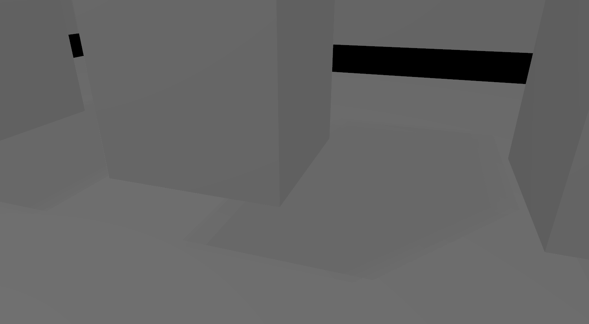 |

### SDFMix

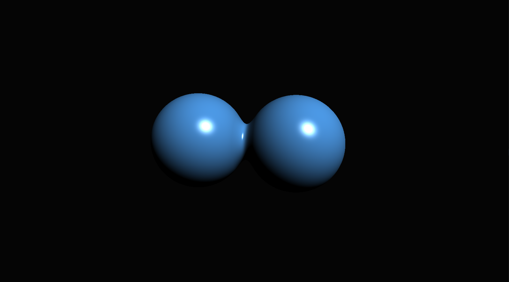

---


---

## 构建与运行

### 环境要求

- Windows + **Visual Studio 2022**

### 获取代码

```bash
git clone --recurse-submodules <repo_url>
```

### 编译与运行（按项目实际情况二选一）

- **方式 A：打开 Solution**
  1. 打开项目生成的 `.sln`
  2. 选择 `Release | x64`
  3. 编译并运行 `Sandbox`

- **方式 B：使用项目脚本**
  - 按根目录提供的生成脚本说明生成工程后编译

### 运行与场景

运行 `Sandbox` 后，可加载/切换场景进行演示：

- `ShadowRoom`
- `SSAORoom`
- `SDFMix`

---

## 演示控制（ImGui）

主要使用 **Global Render Settings** 面板进行实时对比：

- Tonemapping / Exposure / HDR / Bloom / Gamma
- SSAO：开关与参数调整
- 法线贴图：开关
- 视差贴图：开关与模式切换
- 阴影过滤模式：Hard / PCF / PCSS

---

## 技术要点

- **着色器组织**：以字符串内联方式构建 shader，运行时由 `Shader` 类编译；并使用 UBO 进行数据绑定（便于多 Pass 管理）。
- **阴影实现**：
  - 平行光：深度 FBO + shadow map
  - 点光：Cubemap shadow map
  - 在 Lighting Pass 中采样深度贴图完成阴影测试
- **阴影过滤**：
  - PCF：3×3 采样
  - PCSS：近似实现（blocker search + 半影半径估算 + 可变半径 PCF）
- **后处理**：
  - HDR + Bloom
  - 可选高斯模糊（ping-pong）

---

## 联系方式

- 邮箱：<1572326783@qq.com>
- GitHub：https://github.com/tonewworld
